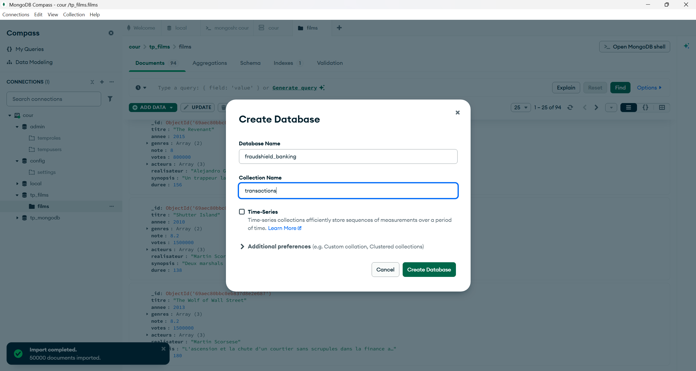
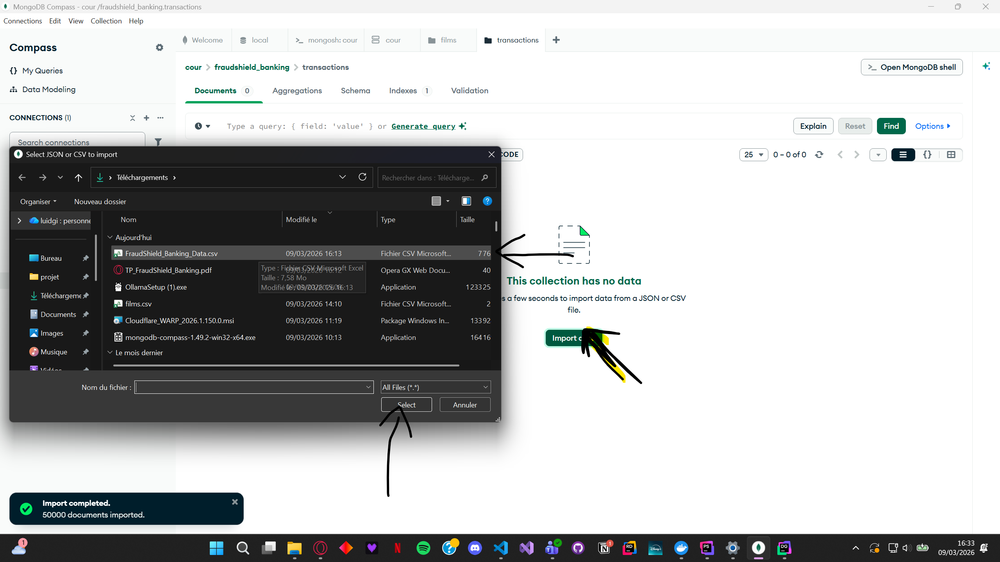
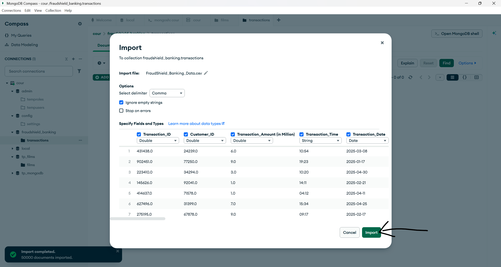

# TP1 - MongoDB : Détection de Fraude Bancaire

## Partie 1 : Import et Validation des Données






### 1.2 Validation de l'import

#### Question 1.2.1 - Affichage des 5 premières transactions

**cf. CMD-1.2.1a** dans `TP1_Partie1.js`

```javascript
db.transactions.find().limit(5).pretty()
```

**cf. CMD-1.2.1b** - Compter le nombre total de documents :

```javascript
db.transactions.countDocuments()
```

**cf. CMD-1.2.1c** - Voir la structure complète d'un document :

```javascript
db.transactions.findOne()
```

#### Analyse de la structure des documents

Le dataset contient **25 champs** par document, organisés en catégories :

| Catégorie       | Champs                                                                 |
|-----------------|------------------------------------------------------------------------|
| **Identifiants**    | Transaction_ID, Customer_ID, Merchant_ID, Device_ID                |
| **Montants (M)**    | Transaction_Amount, Account_Balance, Avg_Transaction_Amount, Max_Transaction_Last_24h |
| **Temporel**        | Transaction_Time (HH:MM), Transaction_Date (YYYY-MM-DD)            |
| **Catégorisation**  | Transaction_Type (POS/ATM/Online), Merchant_Category, Card_Type    |
| **Localisation**    | Transaction_Location, Customer_Home_Location, Distance_From_Home   |
| **Booléens (Yes/No)** | Is_International_Transaction, Is_New_Merchant, Unusual_Time_Transaction |
| **Statistiques**    | Daily_Transaction_Count, Weekly_Transaction_Count, Failed_Transaction_Count, Previous_Fraud_Count |
| **Réseau**          | IP_Address                                                         |
| **Label**           | Fraud_Label (Normal / Fraud)                                       |

---

#### Question 1.2.2 - Conversion des champs Yes/No en booléens

##### Stratégie de conversion

**Problème** : Les champs Yes/No sont stockés comme strings, ce qui :
- Empêche les requêtes booléennes efficaces
- Prend plus d'espace de stockage
- Peut causer des erreurs de logique (comparaisons de strings)

**Solution** : Utiliser `updateMany()` avec l'opérateur `$set`
1. Filtrer les documents avec la valeur `"Yes"` → remplacer par `true`
2. Filtrer les documents avec la valeur `"No"` → remplacer par `false`

##### Implémentation pour 3 champs

| Champ                          | Référence      |
|--------------------------------|----------------|
| Is_International_Transaction   | cf. CMD-1.2.2a |
| Is_New_Merchant                | cf. CMD-1.2.2b |
| Unusual_Time_Transaction       | cf. CMD-1.2.2c |

**Exemple - Conversion de Is_International_Transaction** (cf. CMD-1.2.2a) :

```javascript
// "Yes" → true
db.transactions.updateMany(
    { Is_International_Transaction: "Yes" },
    { $set: { Is_International_Transaction: true } }
)

// "No" → false
db.transactions.updateMany(
    { Is_International_Transaction: "No" },
    { $set: { Is_International_Transaction: false } }
)
```

##### Vérification de la conversion

**cf. CMD-1.2.2-verif** - Voir les valeurs converties :

```javascript
db.transactions.findOne({}, {
    Is_International_Transaction: 1,
    Is_New_Merchant: 1,
    Unusual_Time_Transaction: 1,
    _id: 0
})
```

**cf. CMD-1.2.2-check** - Vérifier qu'il ne reste plus de Yes/No :

```javascript
db.transactions.countDocuments({
    $or: [
        { Is_International_Transaction: { $in: ["Yes", "No"] } },
        { Is_New_Merchant: { $in: ["Yes", "No"] } },
        { Unusual_Time_Transaction: { $in: ["Yes", "No"] } }
    ]
})
// Résultat attendu : 0
```

---

### Récapitulatif des commandes - Partie 1

| Référence        | Description                                      |
|------------------|--------------------------------------------------|
| CMD-1.1          | Import CSV avec mongoimport                      |
| CMD-1.2.1a       | Afficher 5 premières transactions                |
| CMD-1.2.1b       | Compter les documents                            |
| CMD-1.2.1c       | Voir structure d'un document                     |
| CMD-1.2.2a       | Convertir Is_International_Transaction           |
| CMD-1.2.2b       | Convertir Is_New_Merchant                        |
| CMD-1.2.2c       | Convertir Unusual_Time_Transaction               |
| CMD-1.2.2-verif  | Vérifier les valeurs booléennes                  |
| CMD-1.2.2-check  | Vérifier absence de Yes/No restants              |
